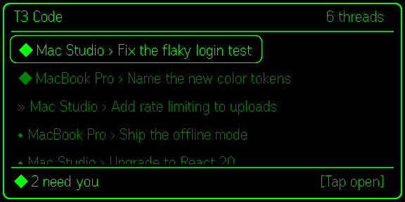
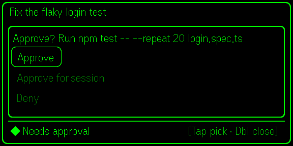
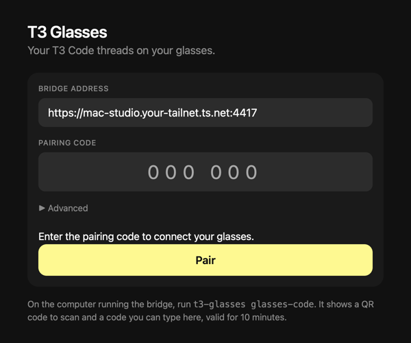
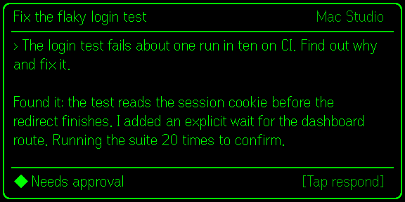
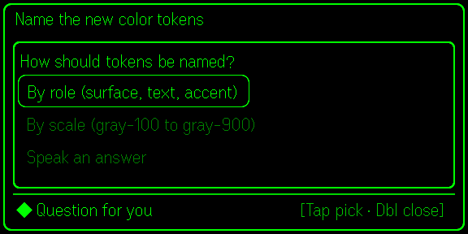
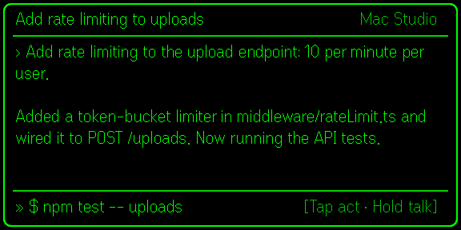
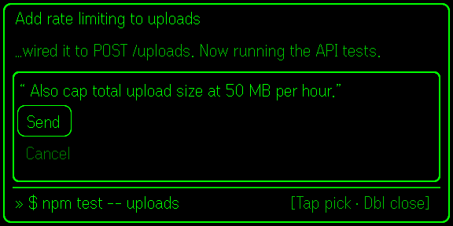
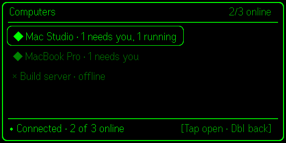

# T3 Glasses

Your [T3 Code](https://t3.codes) threads on Even Realities G2 glasses.

Sign in once and the glasses show the same threads your phone does, from every
computer on your T3 account. Read the latest messages, approve or deny tool
requests, answer questions, interrupt runs, and reply by voice, all with the R1
ring or a tap on the temple.

<p align="center">
  
  
</p>

> Unofficial. Not affiliated with T3 Code or Even Realities.

## Set up in two steps

You need a Mac that stays on, [Tailscale](https://tailscale.com/download) on
that Mac and on your phone (signed in to the same account), and a T3 Code
account with your computers linked through T3 Connect.

**1. On your Mac, run:**

```sh
curl -fsSL https://raw.githubusercontent.com/gerdums/t3-glasses/main/install.sh | bash
```

The installer gets anything missing (Node.js, Tailscale) with Homebrew, then
walks you through the rest:

```
1/5  Sign in to T3                     ✓ Signed in       (email code; GitHub accounts work too)
2/5  Find your computers               ✓ Mac Studio
                                       ✓ MacBook Pro
3/5  Publish the bridge on your tailnet ✓ https://mac-studio.your-tailnet.ts.net:4417
4/5  Voice replies                     ✓ Running locally; audio never leaves this computer
5/5  Start the bridge                  ✓ Runs at login and restarts if it stops
```

and ends with a QR code.

**2. On your phone:** in the Even app, turn on **Developer Mode** (Hardware
tab), open the **Even Hub** tab, tap **Scan QR**, and scan the code. The app
opens on your glasses already paired. That's it.

<p align="center"></p>

Lost the QR code, or it expired after 10 minutes? Run `t3-glasses glasses-code`.

## What runs on your Mac

Setup installs two macOS login agents. They start when you log in and restart
if they stop, so there's nothing to keep open:

| Agent | What it does |
|---|---|
| `io.github.gerdums.t3-glasses` | The bridge: keeps a live connection to each of your T3 computers and serves the glasses app on your tailnet |
| `io.github.gerdums.t3-glasses.whisper` | [whisper.cpp](https://github.com/ggml-org/whisper.cpp) speech-to-text for voice replies, kept warm so transcription takes well under a second |

Check on them with `t3-glasses status`. Logs are in `~/Library/Logs/t3-glasses*.log`.
Computers you link to T3 Connect later show up on the glasses automatically.

## Using it

| | |
|---|---|
|  |  |
|  |  |

| Gesture | Lists | In a thread |
|---|---|---|
| Scroll | Move through the list | Page back through older messages |
| Tap | Open | Show actions: approve, answer, reply, interrupt |
| Double-tap | Back | Back (closes a card first) |
| Press and hold | | Record a voice reply; release to stop |

Home lists your threads across all computers, with anything waiting for you on
top. The last row opens **Computers**, one list per machine.

<p align="center"></p>

Markers: `◆` needs you · `»` running · `×` failed · `•` finished · `·` idle.

## Commands

```
t3-glasses setup            Run the guided setup again (safe; finished steps are skipped)
t3-glasses status           Account, computers, services, and the bridge address
t3-glasses glasses-code     New pairing QR code
t3-glasses service restart|status|uninstall
t3-glasses uninstall        Remove the services, tailnet address, sign-in, and settings
```

Update by running the install command again. More: `t3-glasses help`.

<details>
<summary><b>Other ways to install the glasses app</b></summary>

Scanning the QR code uses the Even app's developer mode, which loads the app
from your bridge. To install it like a regular Even Hub app instead, build a
private package for your bridge and upload it under **Private builds** in the
[Even Hub developer portal](https://hub.evenrealities.com):

```sh
cd ~/.t3-glasses
BRIDGE_URL=https://mac-studio.your-tailnet.ts.net:4417 npm run pack -w @t3-glasses/glasses
```

Install `apps/glasses/t3-glasses.ehpk` from the Even app, open it, and enter
the 6-digit code from `t3-glasses glasses-code`.

</details>

<details>
<summary><b>Voice options and computers not on T3 Connect</b></summary>

- Skip local voice with `t3-glasses setup --no-voice`, or use OpenAI instead:
  `t3-glasses transcription openai` with `OPENAI_API_KEY` set, then
  `t3-glasses service install`.
- A computer that isn't linked to T3 Connect can be paired directly:
  create a pairing link in T3 Code's **Settings → Connections**, then
  `t3-glasses pair '<link>'` and `t3-glasses service restart`.
- Linux: clone the repo, `npm ci && npm run build`, then
  `node packages/bridge/dist/cli.js setup` and run `t3-glasses serve` under
  your own supervisor.

</details>

## Security

- The bridge holds your T3 sign-in and can read and act on threads on every
  linked computer. It asks each computer only for thread access
  (`orchestration:read orchestration:operate`): no terminal, files, or settings.
- It's reachable only on your tailnet, over HTTPS. The glasses get their own
  token through a single-use pairing code (10 minutes, 5 tries).
- Voice is transcribed on your Mac by default.
- Secrets live in `~/.config/t3-glasses/config.json` with owner-only permissions.
- Signing in uses T3's public web client id with the T3 Connect relay, which T3
  doesn't document for third-party apps. A T3 update could break it.

## Development

```sh
npm install && npm run build
npm test                  # bridge and glasses unit tests
```

- [docs/architecture.md](docs/architecture.md): how the bridge talks to T3
- [docs/glasses-ux.md](docs/glasses-ux.md): the display design
- [apps/glasses/README.md](apps/glasses/README.md): simulator workflow;
  `apps/glasses/dev/shots.html` renders these screenshots from sample data
